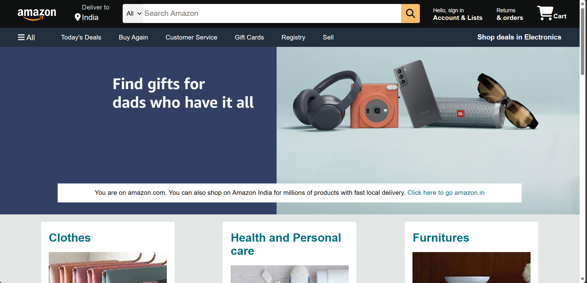
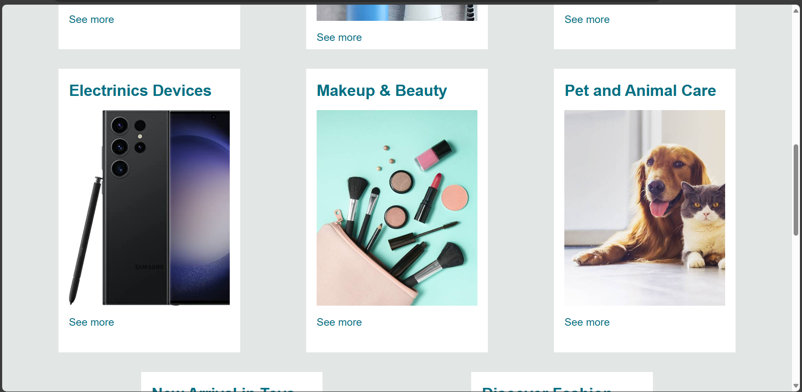
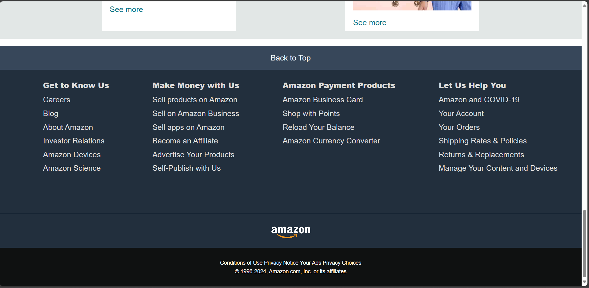

# Amazon_clone
 This is the fun project where we created a clone of Amazon and added some major functionality.
 Amazon Clone (frontend) created with HTML and CSS.

 ## Note
This repository is still under development and We will continue to add more features to it.

## Homepage screenshots

&nbsp; &nbsp;

&nbsp; &nbsp;

## Features 
- User Registration, Login, Logout.

- Dashboard showing user's products, orders, reviews etc.

- Search bar for searching any product by name or category.

- Product listing page which shows all available products in different categories.

- Add to cart feature.

- Shopping Cart which displays all items added to the cart along with their quantity.

## How to Contribute

We appreciate and welcome contributions from the community to help expand and improve this project. If you wish to contribute, follow these steps:
1. Fork the project
2. Create your clone branch 
3. Make required changes and commit (git commit -m 'Add some feature')
4. Push to the branch (git push )
5. Create new Pull Request
---
## Contributers

Made with [contrib.rocks](https://contrib.rocks).
---
Github Link :https://github.com/sagardenge1/amazon_clone
---
Netlify Link :https://amazon-clone-first1.netlify.app/
---